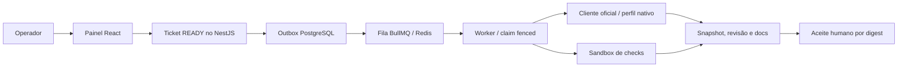

> Leitura: [← Anterior](03-glossario.md) · [Índice didático](../02-INDEX.md) · [Próximo assunto →](../02-arquitetura/00-README.md)

# Mapa didático do sistema atual

Base a2cc5e0; implementação inspecionada, operação real NÃO VERIFICADA nesta migração.

[C4 e canais](../02-arquitetura/03-containers.md), [fluxo detalhado](../02-arquitetura/05-fluxos.md). Broker/tenancy são [direção posterior](../02-arquitetura/11-containers-alvo.md), sem seta para controle/auth/DB/Redis na sandbox ou broker.
