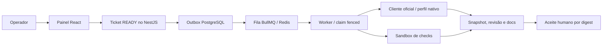

# Mapa didático do sistema atual

Base a2cc5e0; implementação inspecionada, operação real NÃO VERIFICADA nesta migração.

[C4 e canais](../02-arquitetura/containers.md), [fluxo detalhado](../02-arquitetura/fluxos.md). Broker/tenancy são [direção posterior](../02-arquitetura/containers-alvo.md), sem seta para controle/auth/DB/Redis na sandbox ou broker.
