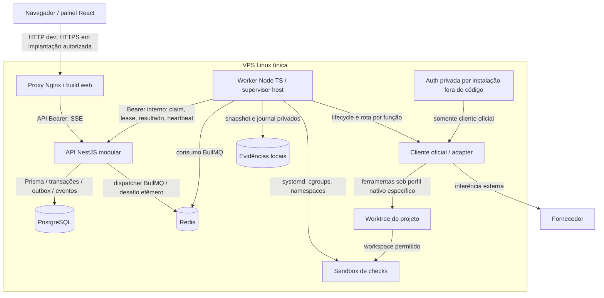

> Leitura: [← Anterior](02-contexto.md) · [Índice didático](../02-INDEX.md) · [Próximo →](04-componentes.md)

# C4 nível 2 — containers atuais

Base a2cc5e0. Unidades C4 descrevem processos/armazenamento, não necessariamente containers Docker. Código/Compose presentes, deploy efetivo NÃO VERIFICADO.

Outbox no PostgreSQL; Redis fila/cache efêmero não é autoridade de stop. API e Redis em loopback para worker host, PostgreSQL sem porta pública no Compose controle. Nginx bloqueia internal no canal público. Worker não é iniciado pelo Compose. Supervisor faz checkout/coleta fora da sandbox. Checks não acessam controle/auth/DB/Redis/daemon; perfil de ferramentas do cliente exige prova independente, sem inferir eficácia pelo desenho.

AS-IS não possui broker remoto. [Containers alvo](11-containers-alvo.md) conserva auth segregada/runtime por tenant/broker sem controle e sandbox efêmera, todos como proposta posterior. Cliente sem ponte suportada permanece incompatível com esse perfil; sem contorno OAuth/API/auth mount.
