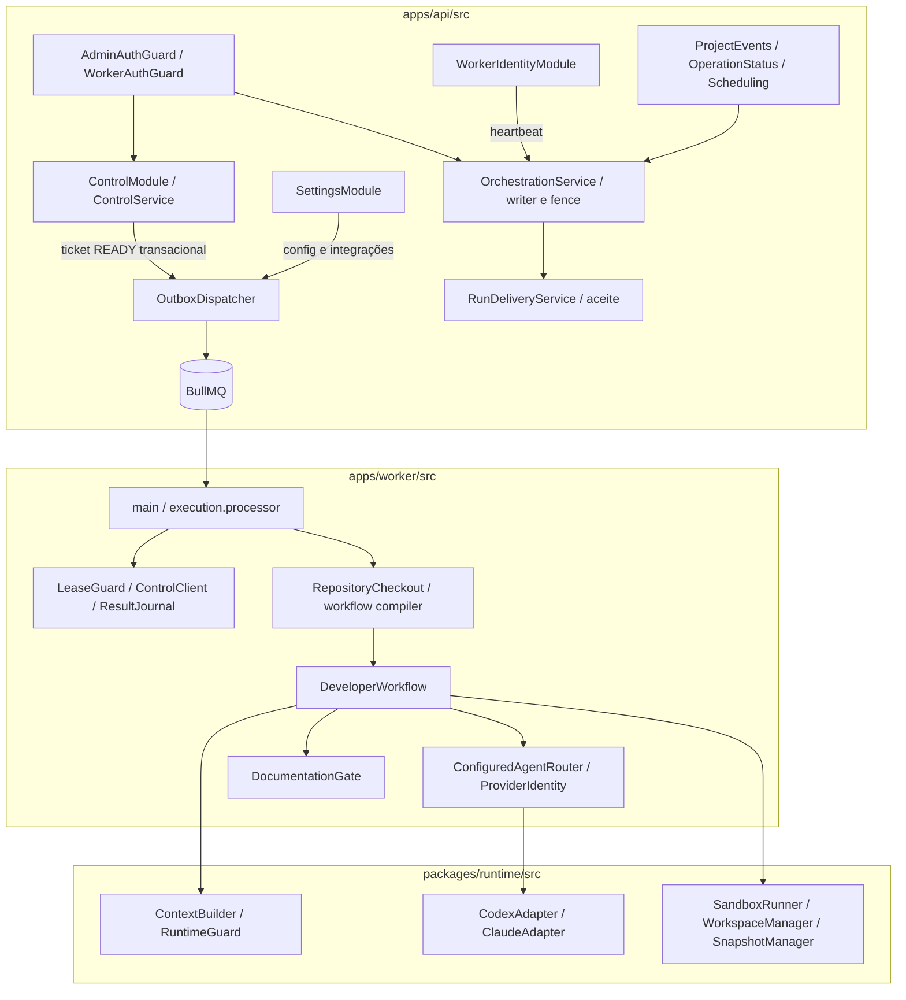

# C4 nível 3 — componentes atuais

Base a2cc5e0. Monólito modular na API; responsabilidades do worker/runtime em processo separado. Caminhos reais, sem src/modules inventado.

Context Builder e execução do gate são no worker/runtime, não shell na API. API valida evidências/hashes para aceite. PostgreSQL fecha exclusão global; BullMQ lock não a substitui. Antigravity possui integração de login/status, sem adapter de execução. [Componentes alvo](componentes-alvo.md) acrescentam tenancy/broker/capabilities propostos.
