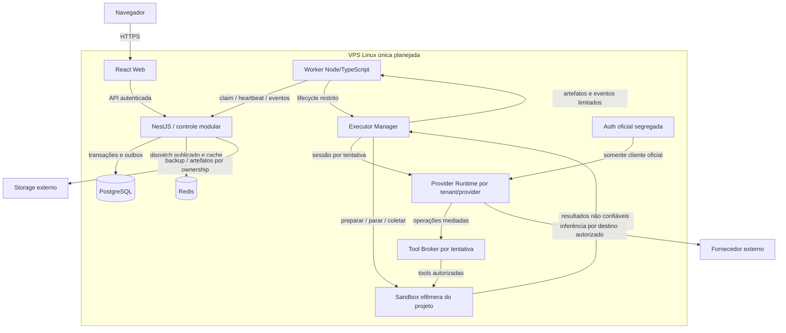

> Proposta posterior do pacote, não estado implementado. Conciliação: [AS-IS](as-is.md). Sem liberação de provider/runtime por este diagrama.

# C4 nível 2 — containers

Revisão documental: 2026-10-06 (America/Sao_Paulo). Arquitetura **PLANEJADA**; implementação e eficácia **NÃO VERIFICADAS** na origem do pacote.

Redis recebe publicação derivada da outbox; a outbox persiste no PostgreSQL. Nenhuma seta concede sandbox/broker acesso a PostgreSQL/Redis/API geral/auth/daemon. As unidades C4 podem corresponder a processos/serviços, não exigem microserviços. React pode ser servido pelo proxy; forma real de empacotamento permanece pendente.

Um runtime por tenant/provider e sessão por attempt é requisito planejado. Cliente incapaz de mediar tools fica DISABLED/UNSUPPORTED_ISOLATION. Backup externo não requer segunda VPS de execução.

## Proveniência

- [Base v3](fronteiras-e-invariantes.md)
- [Runtime](../03-modulos/runtime/README.md)
