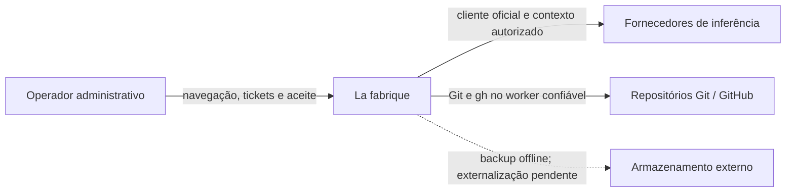

# C4 nível 1 — contexto atual

Base a2cc5e0, estrutura inspecionada, eficácia de implantação NÃO VERIFICADA nesta migração.

Inferência ocorre no fornecedor. Cadastro de conta não prova autenticação/eligibilidade. GitHub tem fluxos implementados sob gate; integração real exige evidência própria. Home inicial é demonstrativa. Nenhum sistema externo concede autoridade por output de modelo. [Contexto alvo posterior](contexto-alvo.md).
