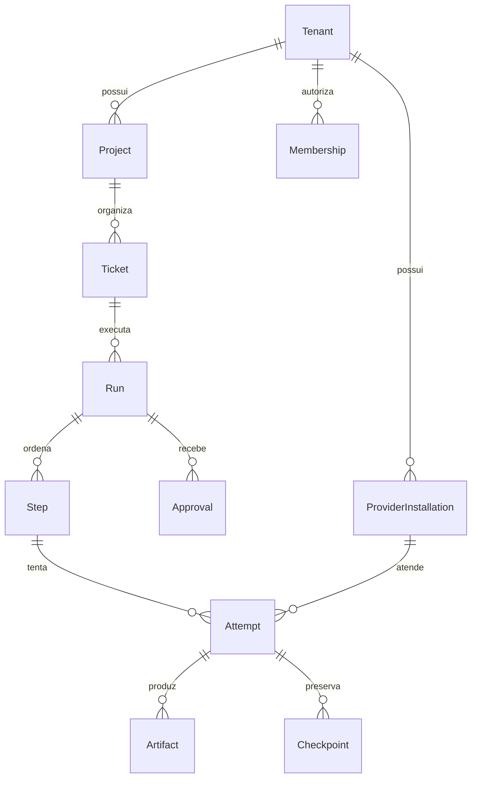

> Proposta posterior do pacote, não estado implementado. Conciliação: [AS-IS](as-is.md). Sem liberação de provider/runtime por este diagrama.

# Arquitetura de dados

Revisão documental: 2026-10-06 (America/Sao_Paulo). Arquitetura **PLANEJADA**; implementação e eficácia **NÃO VERIFICADAS** na origem do pacote.

PostgreSQL é a fonte de workflow/identidade, com outbox transacional, optimistic version e eventos deduplicados. Redis serve fila/cache e não oferece RLS. Artefatos imutáveis por hash têm ownership tenant/projeto/run/attempt e storage próprio.

Diagrama conceitual, sem cardinalidades físicas verificadas nem migrations executadas. [Entidades canônicas](../05-contratos/schemas/entidades.md) descrevem campos; [isolamento](../03-modulos/tenant-isolation/README.md) descreve integridade e RLS. Dinheiro decimal; uso/custo ausentes ficam unknown. Não migrar órfãos para tenant arbitrário.
