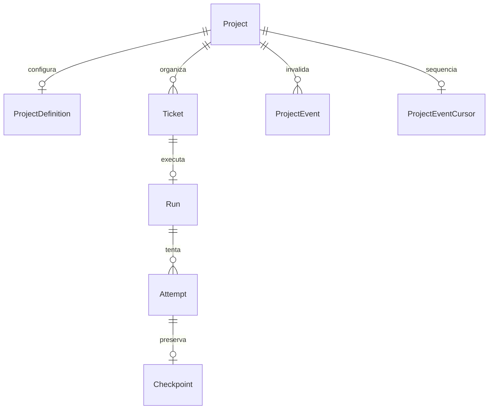

# Dados — estrutura observada

Base a2cc5e0, conferido em schema Prisma. Migrations podem impor invariantes adicionais. [Contrato de dados](../05-contratos/schemas/entidades.md).

Run único por ticket; resultados/artifacts/approval/configuração são JSON. OutboxEvent persiste intenção no banco, Redis transporta. Nenhuma tenancy/RLS/Step/Ledger físico nesta revisão. [Dados alvo propostos](dados-alvo.md).
