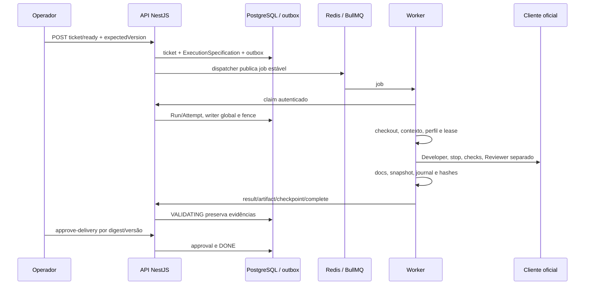

# Fluxo implementado e handoff

Base a2cc5e0, leitura de ControlService/OrchestrationService/worker/workflow/RunDeliveryService; software NOT_RUN aqui.

Handoff Y exige stop conhecido/snapshot, cria outra worktree e revalida alternativa, conservando autoridade da Attempt/lease/fence durante o workflow. Resume administrativo é nova tentativa/fence a partir de snapshot parado. Recuperação de finalização reenvia journal/reconcile sem IA. [Estados](../05-contratos/schemas/workflow.md), [handoff](../07-operacao/handoff.md), [fluxos alvo](fluxos-alvo.md).
