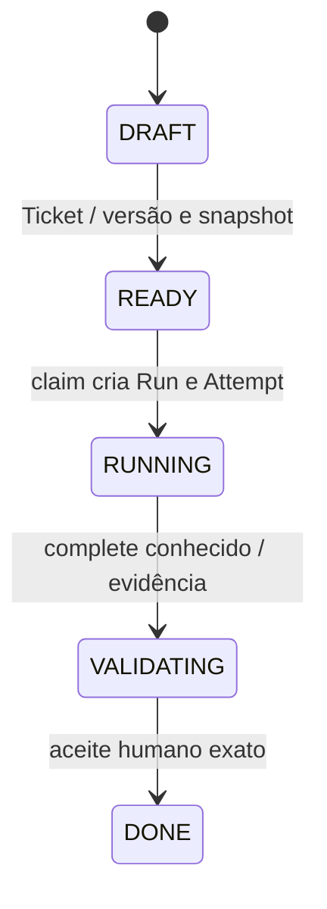

# Estados por entidade — código como fonte

Base a2cc5e0. [Prisma](../../../apps/api/prisma/schema.prisma) e [Zod](../../../packages/contracts/src/index.ts).

## TicketStatus

`DRAFT`, `READY`, `WAITING_WORKER`, `RUNNING`, `VALIDATING`, `REVIEW`, `DOCS`, `AWAITING_HUMAN`, `DONE`, `WAITING_PROVIDER`, `PAUSED`, `PAUSED_LIMIT`, `PAUSED_RESOURCE`, `BLOCKED_RECOVERY`, `AUTH_REQUIRED`, `FAILED`, `CANCELLED`.

## RunStatus

`WAITING_WORKER`, `WAITING_PROVIDER`, `RUNNING`, `VALIDATING`, `DONE`, `PAUSED`, `PAUSED_LIMIT`, `BLOCKED_RECOVERY`, `FAILED`, `CANCELLED`.

## AttemptStatus

`RUNNING`, `STOPPED`, `COMPLETED`, `FAILED`, `CANCELLED`.

## Fluxo persistido comprovado por leitura

Este é um recorte do caminho feliz do ticket, não a totalidade do enum. Run inicia WAITING_WORKER e avança por serviços; estado de etapa REVIEW/DOCS/AWAITING_HUMAN no workflow não implica escrita automática equivalente em Run. Gate de aceite exige Run/Ticket VALIDATING e workflow result AWAITING_HUMAN/APPROVED. Attempt COMPLETED exige stoppedConfirmed, sem equivaler a DONE do ticket.

PAUSED é pausa manual; PAUSED_LIMIT limites; PAUSED_RESOURCE existe no Ticket, não no Run enum atual. BLOCKED_RECOVERY representa recuperação bloqueada; PAUSED_BUDGET e BLOCKED genérico são nomes históricos sem enum físico atual. AUTH_REQUIRED é estado de Ticket/provider/erro conforme contrato, não RunStatus.

## Recuperação e concorrência

PAUSE/CANCEL registram intenção; stop é evidência externa. Resume valida checkpoint/artifact/versão e abre tentativa/fence novos; handoff interno Y troca cliente sob a mesma Attempt/lease/fence. Writer unknown não libera por status/idade. Approval só muda DONE quando hashes/checks/revisão/docs/stop coincidem. Transições completas estão nos serviços e testes versionados, não inferidas das setas.

Resultado: enums conferidos por leitura; testes de software NOT_RUN nesta migração. Alterar estado exige contrato/migration/compatibilidade em ticket próprio; nenhum enum foi mudado por documentação.
