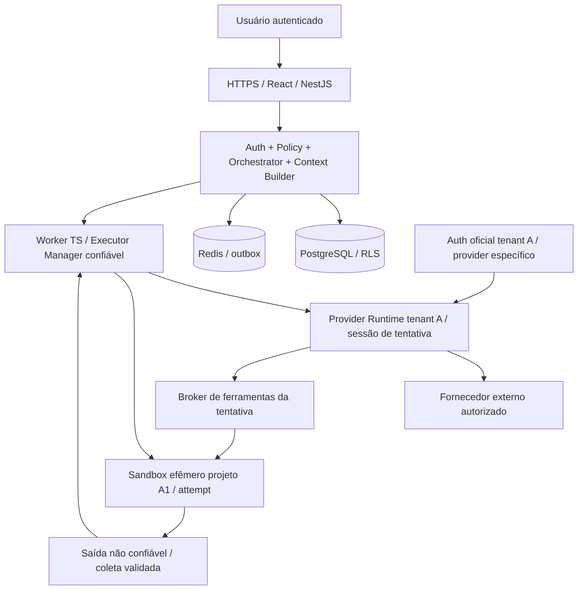

# Arquitetura multi-tenant na VPS única

Data: 2026-10-06 (America/Sao_Paulo). Status da arquitetura e controles: **PLANEJADO**. Implementação e eficácia: **NÃO VERIFICADAS**. Este documento especifica trabalho futuro; não comprova instalação, configuração ou execução.

## Invariantes obrigatórios

| ID | Invariante | Enforcement planejado |
|---|---|---|
| I-01 | Nenhuma operação cruza tenant | identidade derivada, FK composta, autorização, RLS, storage e protocolo |
| I-02 | Uma execução vê somente projeto/revisão concedidos | JobPackage mínimo, sandbox e broker vinculados à tentativa |
| I-03 | IA/código não alcançam dados ou autoridade do controle | nenhuma credencial administrativa, nenhuma rota interna, mounts mínimos |
| I-04 | Segredos de IA nunca chegam ao sandbox/contexto/artefatos | CredentialStore e auth oficial só no runtime específico |
| I-05 | Toda ferramenta é autorizada fora do modelo | broker valida identidade, política, prazo, lease e fencing |
| I-06 | Execução nova não herda estado privado | tentativa efêmera, HOME/sessões/cache segregados, checkpoint selecionado |
| I-07 | Um writer, inclusive após crash | lock, fencing, término comprovado; lease sozinho não basta |
| I-08 | Rede e filesystem negam por padrão | namespaces, firewall/proxy, mounts por identidade, LSM/seccomp |
| I-09 | Falha de política bloqueia execução | fail-closed; sem fallback global, host shell ou API paga |
| I-10 | Evidência pertence à revisão/configuração testadas | hashes e registro de testes; alterações invalidam aceite |

## Componentes e fronteiras

Setas representam canais específicos permitidos, não redes compartilhadas. O sandbox não possui canal para PostgreSQL, Redis, API geral, credenciais ou daemon. Broker está na zona de execução, sem DB/Redis/credenciais de provider e sem API administrativa. Executor controla lifecycle; modelo não escolhe mounts, rede, instalação, comandos do host ou limites. Retorno de resultados existe e atravessa validação; não usar a expressão “one-way” para esconder esse canal.

Plano de controle inclui NestJS, auth, projetos, workflow, banco e fila. Executor Manager possui autoridade mínima sobre lifecycle e coleta e não é ferramenta da IA. Se daemon exigir root, encapsular em helper pequeno que recebe apenas IDs de perfis cadastrados; nenhuma flag livre de mount, privileged, imagem ou rede aceita da IA. Worker geral não deve pertencer ao grupo Docker nem carregar toda autoridade do daemon.

Provider Runtime: processo/serviço isolado por tenant e provider, com home oficial próprio. Sessão por attempt; nenhuma memória persistente de um projeto reutilizada por outro. A lógica do adapter/broker é confiável sob administração; o modelo e o conteúdo que ela processa não são. O processo autenticado precisa falar com o fornecedor, mas não executar código do cliente localmente. Se plugins/hooks/tools nativos puderem executar shell no runtime, desligá-los tecnicamente ou bloquear provider.

## Base e limites

Manter React/NestJS/Node-TS/Postgres/Redis, monólito modular quando adequado, uma VPS e um executor inicial. Inferência externa; sem GPU. Controle tem recursos reservados. Runtime, sandboxes e serviços sintéticos cabem no envelope agregado. VPS única é ponto único de falha. Container endurecido é perfil de piloto confiável; gVisor/Kata/microVM é trilha de avaliação para código hostil, sem exigir nova VPS por padrão.

Projetos do mesmo tenant não se tornam automaticamente visíveis à IA. Usuário pode ter permissões amplas dentro do tenant; cada attempt continua com um projeto. Integração entre projetos exige pacote explícito de arquivos autorizado e auditado ou execução separada; nunca montar diretório pai de todos os projetos.

## Critério para habilitar

Revisão exata e versão de política aprovadas; adapter comprova ferramentas exclusivamente mediadas; controles da VPS verificados; testes A/B e A1/A2 aprovados; kill switch e recovery comprovados. Provider sem suporte retorna UNSUPPORTED_ISOLATION. Piloto não equivale a prontidão comercial. [Threat model](../seguranca/THREAT-MODEL.md) registra risco residual e gate de código não confiável.
