# Mapa do sistema

Revisão documental: 2026-10-06 (America/Sao_Paulo). Arquitetura **PLANEJADA**; implementação e eficácia **NÃO VERIFICADAS** neste espelho.

```mermaid
flowchart LR
  U[Usuário] --> P[Painel React]
  P --> T[Ticket no controle NestJS]
  T --> R[Run e orquestrador]
  R --> W[Worker e Executor]
  W --> A[Runtime de provider]
  A --> B[Broker]
  B --> S[Sandbox de projeto]
  S --> C[Checks e revisão]
  C --> D[Docs e evidências]
  D --> H[Aceite humano da revisão]
```

Este é o fluxo didático planejado; canais e fronteiras estão detalhados no [C4](../02-arquitetura/containers.md). Não há seta de sandbox para banco, credenciais ou API administrativa.
