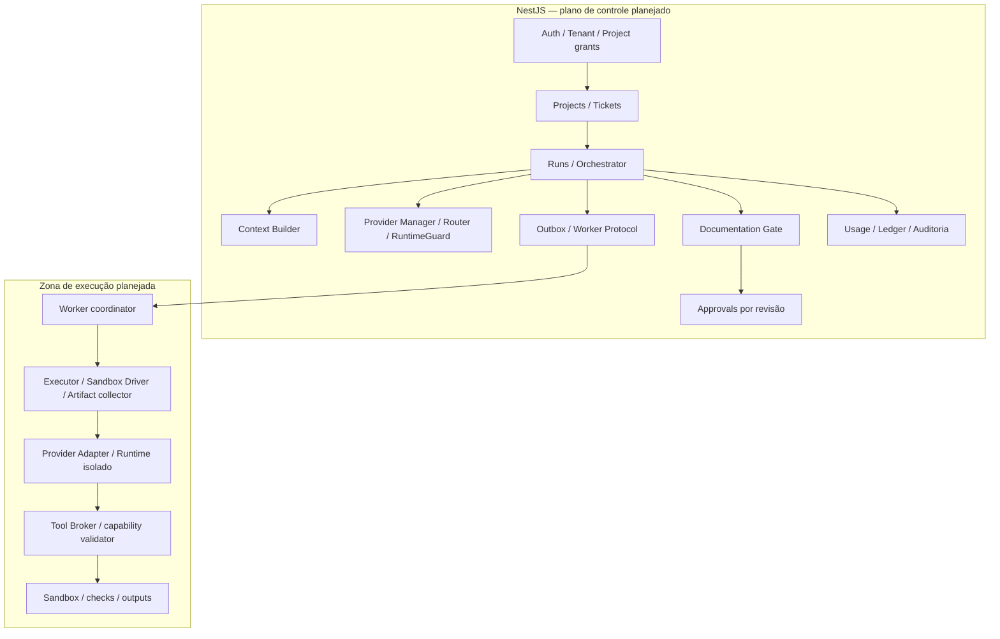

# C4 nível 3 — componentes

Revisão documental: 2026-10-06 (America/Sao_Paulo). Arquitetura **PLANEJADA**; implementação e eficácia **NÃO VERIFICADAS** neste espelho.

Auth resolve autoridade antes de qualquer recurso; Orchestrator coordena transições e não executa shell. Context Builder seleciona fontes. Provider Manager escolhe instalação elegível, sem troca entre tenants. Executor controla recursos e término. Broker possui apenas manifesto restrito da tentativa, sem credenciais administrativas. Gate verifica docs e evidência; Approval registra ação humana.

Nomes representam responsabilidades lógicas. Caminhos de código, classes e injeção NestJS devem ser preenchidos somente ao inspecionar o repo real. [Módulos](../03-modulos/README.md) detalham cada responsabilidade.
