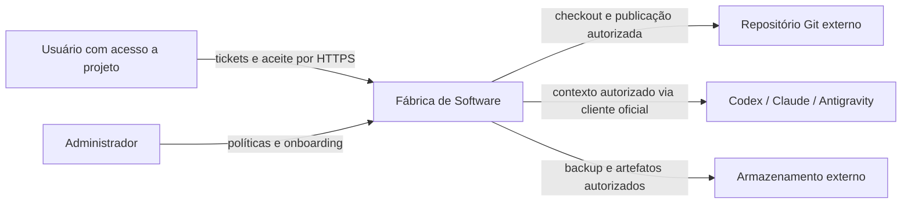

# C4 nível 1 — contexto

Revisão documental: 2026-10-06 (America/Sao_Paulo). Arquitetura **PLANEJADA**; implementação e eficácia **NÃO VERIFICADAS** neste espelho.

GitHub é um exemplo de hospedagem Git, não integração já implementada. Usuário e administrador são papéis, não serviços. Fornecedores veem o contexto autorizado por design; segredos e dados de outros projetos não integram esse contexto. Integrações externas e elegibilidade permanecem a validar.
