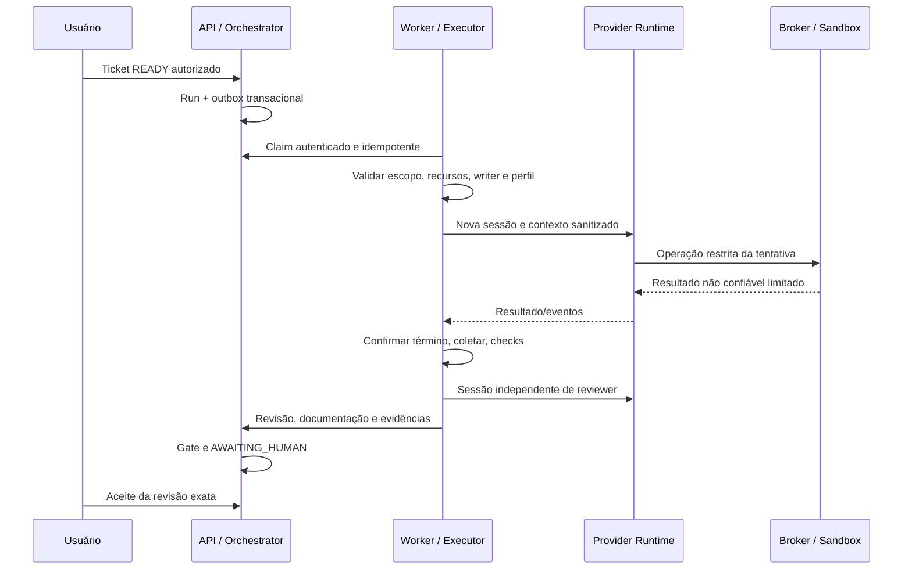
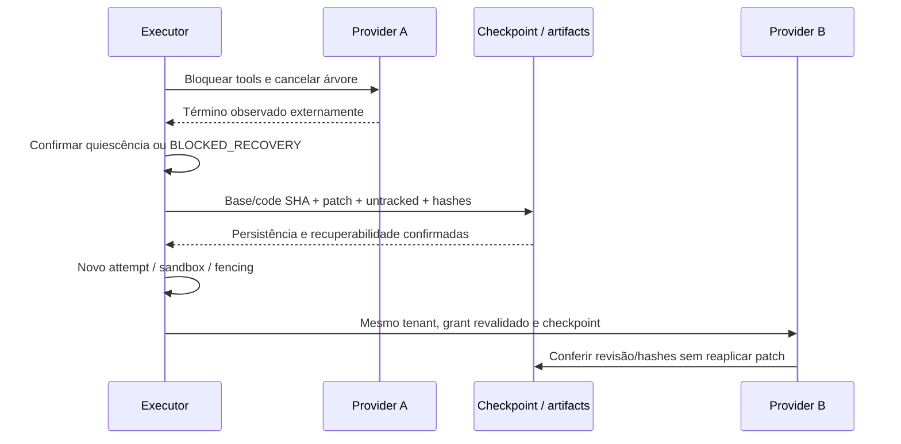

# Fluxos principais

Revisão documental: 2026-10-06 (America/Sao_Paulo). Arquitetura **PLANEJADA**; implementação e eficácia **NÃO VERIFICADAS** neste espelho.

## Ticket até aceite

Até duas correções; alterações exigem novos checks pertinentes. Exit code ou mensagem finished não comprova aceite.

## Handoff seguro

Se término não é comprovado, não há segundo writer. Falta de quota não seleciona conta de outro cliente. [Handoff canônico](../07-operacao/handoff.md).

## Recuperação e revogação

Reboot reconcilia processes/cgroups/claims/artefatos órfãos antes de admission. Revogar membership/instalação bloqueia claims/capabilities e interrompe attempts afetadas. Restore valida ownership e hashes em ambiente privado. Detalhes em [execução e recuperação](../07-operacao/execucao-e-recuperacao.md).

Máquina de estados e transições pertencem ao [contrato de workflow](../05-contratos/schemas/workflow.md); ciclo de sandbox pertence ao [módulo sandbox](../03-modulos/sandbox/README.md).
