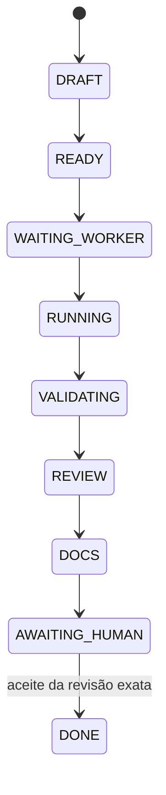

# Estados e transições

Revisão documental: 2026-10-06 (America/Sao_Paulo). Arquitetura **PLANEJADA**; implementação e eficácia **NÃO VERIFICADAS** neste espelho.

Diagrama do caminho feliz. Estados laterais documentados: WAITING_PROVIDER, PAUSED_LIMIT, PAUSED_RESOURCE, BLOCKED_RECOVERY, AUTH_REQUIRED, FAILED e CANCELLED. Rotas/arestas detalhadas e entidade portadora do estado (Ticket versus Run) devem ser confirmadas no código; não inventar que este diagrama cobre todas as transições.

Cada transição guarda ator/evento/revisão/motivo e version para concorrência. Resume cria nova attempt a partir de checkpoint; não salta para DONE. CANCELLED só com reconciliação da execução, preservando resultado desconhecido quando necessário.

O texto antigo da arquitetura citava PAUSED_BUDGET e BLOCKED, enquanto ESPEC v2 usa PAUSED_RESOURCE/BLOCKED_RECOVERY. Estes últimos são a base documental atual; PAUSED_BUDGET é extensão monetária futura com API desabilitada, não novo estado imposto ao código. POLICY_UNAVAILABLE, SECURITY_DENIED e UNSUPPORTED_ISOLATION são reason/error codes propostos, não estados automaticamente adicionais.

## Proveniência

- [Máquina de estados v2](../../99-historico/originais/sources/ESPEC-MVP.md)
- [Semântica v3](../../07-operacao/execucao-e-recuperacao.md)
